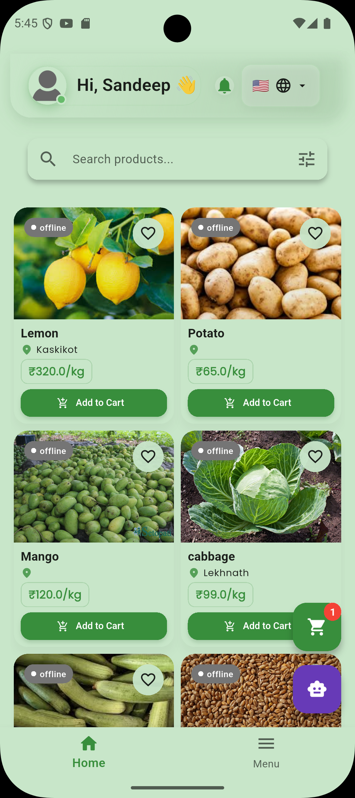
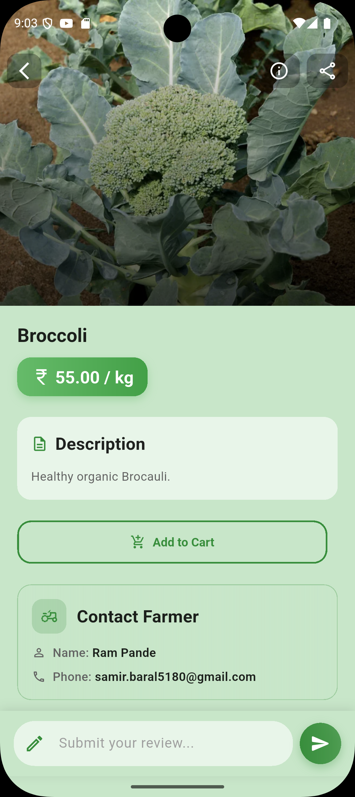
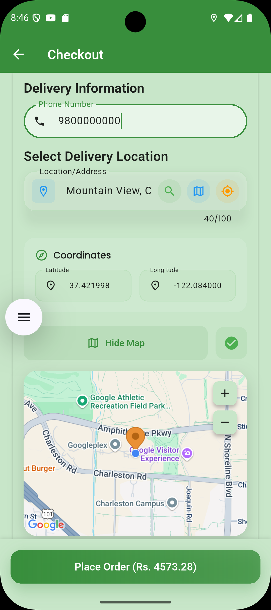
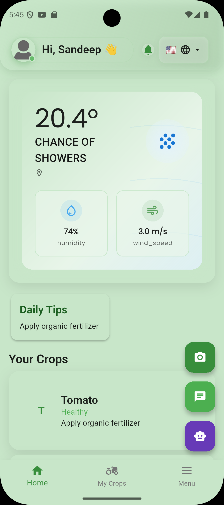
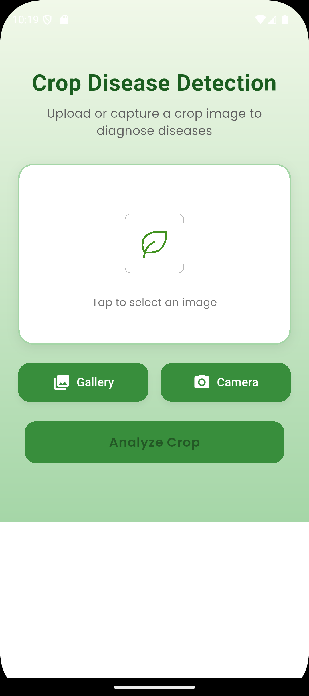
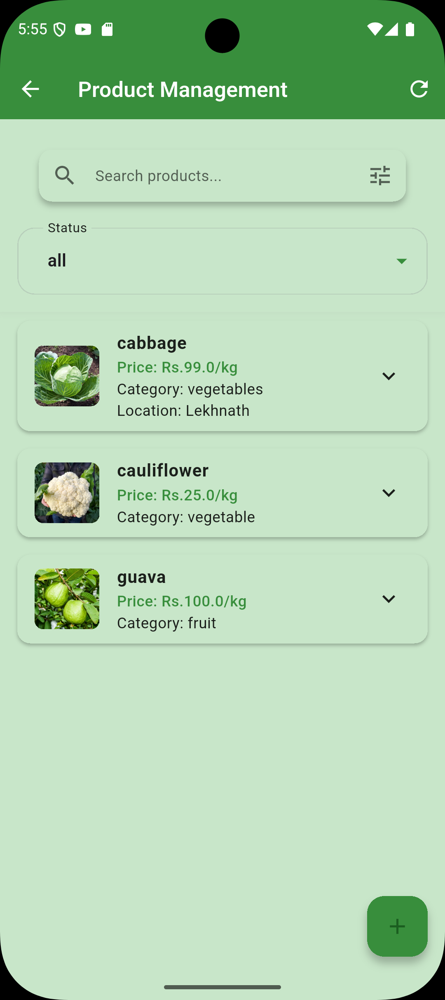
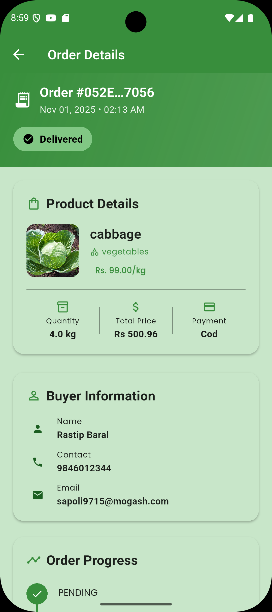

# KrishiLink

A modern marketplace connecting farmers and buyers in Nepal — with secure payments (eSewa & Khalti), chat, maps, and AI-powered disease detection.


## ✨ Features

- Buyer & Farmer flows with role-based navigation
- Product catalog, search, and reviews
- Order management (buyer & farmer) with status tracking
- Secure payments via backend-integrated eSewa and Khalti (WebView)
- Live chat between buyer and farmer and chat bot helper
- Maps and delivery location picker
- AI-powered plant disease detection

## 🖼️ Screenshots

These demo snapshots live under `lib/src/core/assets/demo_images/` and are safe to update/replace.

<p align="center">
	
	
	
</p>
<p align="center">
	
	
	
	
</p>

> Tip: Add more images to `lib/src/core/assets/demo_images/` and reference them here to expand the gallery.

## 🧩 Tech Stack

- Flutter, Dart
- GetX (state , routes)
- Dio (networking), WebView
- Google Maps & Places

## 🔐 Payments (Backend-driven)

This app integrates payments via yourour backend endpoints, not the SDK directly:

- eSewa: `POST /api/Payment/initiatePaymentForEsewa` → auto-submitted form in WebView → backend success/failure callbacks
- Khalti: `POST /api/Payment/initiatePaymentForKhalti` → open returned paymentUrl in WebView → backend `khaltiResponse` callback

Key URLs are defined in `lib/src/core/constants/api_constants.dart` and rendered through `PaymentWebViewScreen`.

If you plan to use direct PSP keys at runtime, see `lib/src/features/payment/data/payment_keys.dart` (supports `--dart-define` overrides for `KHALTI_PUBLIC_KEY` / `KHALTI_SECRET_KEY`).

## 🚀 Getting Started

Prerequisites:

- Flutter SDK installed
- A running backend (see `ApiConstants.baseUrl`)

Run app:

```bash
flutter pub get
flutter run
```

Optional defines (if you choose to override test keys):

```bash
flutter run \
	--dart-define=KHALTI_PUBLIC_KEY=live_public_key_xxx \
	--dart-define=KHALTI_SECRET_KEY=live_secret_key_xxx
```

## 📁 Project Docs

- Architecture: `ARCHITECTURE.md`

## 🧭 Folder Highlights

- `lib/features` — Screens & feature modules (auth, buyer, payment, product, etc.)
- `lib/src/core` — Shared constants, networking, errors, assets
- `lib/src/features/payment` — Backend services and WebView flow

## 🤝 Contributing

PRs and issues are welcome. Please follow existing patterns (GetX, Dio) and keep commits scoped and descriptive.

## 📜 License

MIT — see `LICENSE` (or add one if not present).

